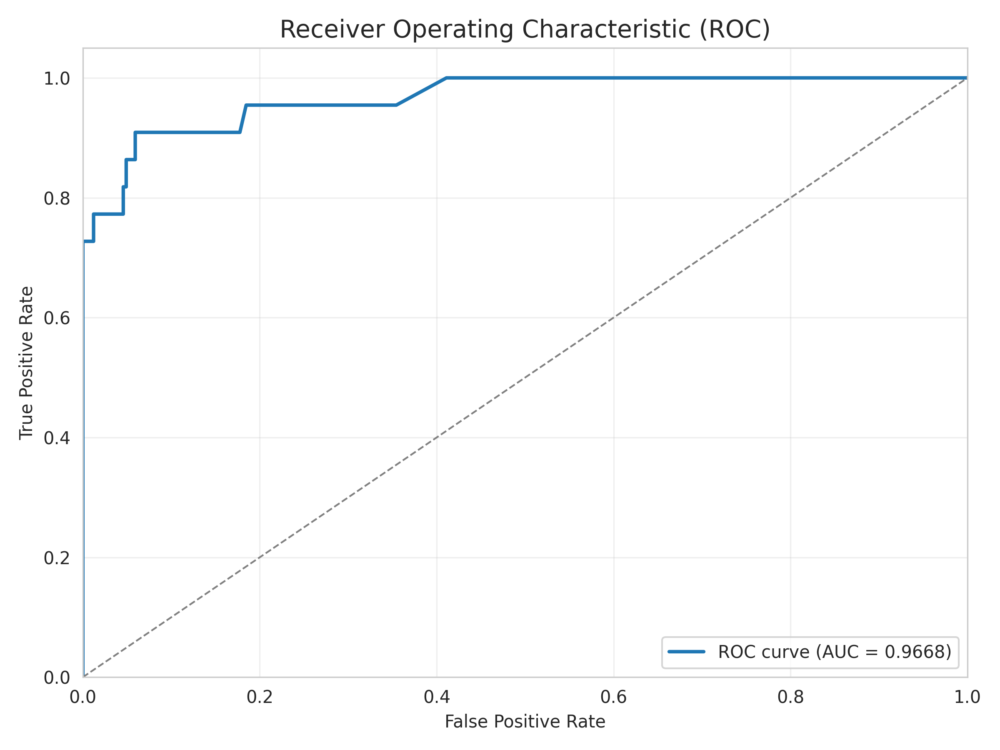

<div align="center">

# Sentinel

### End-to-End MLOps Credit Card Fraud Detection

[](https://python.org)
[](https://fastapi.tiangolo.com)
[](https://xgboost.readthedocs.io)
[](https://mlflow.org)
[](LICENSE)

**[Live Demo](https://sentinel-08u6.onrender.com/docs)** | **[Experiments](https://dagshub.com/hammadmunir959/my-first-repo.mlflow)**

</div>

---

## Overview

Sentinel is a production-grade MLOps pipeline demonstrating best practices in machine learning operations. Built for credit card fraud detection, it showcases data versioning, experiment tracking, model serving, drift monitoring, and automated deployment.

### Key Features

- **High Recall Model** - Catches 84% of fraudulent transactions
- **Real-time API** - FastAPI with sub-100ms inference latency
- **Experiment Tracking** - MLflow integration via DagsHub
- **Data Versioning** - DVC for reproducible pipelines
- **Drift Monitoring** - Evidently AI for production monitoring
- **CI/CD** - GitHub Actions with CML reporting
- **Containerized** - Docker-ready for any cloud platform

---

## Model Performance & Benchmarks

Rigorous testing was conducted against **10,000** unseen transactions using the local API.

### Metrics Summary
| Metric | Value | Interpretation |
|--------|-------|----------------|
| **ROC-AUC** | **0.9668** | Excellent discrimination between fraud & legit |
| **Recall** | **0.7273** | Caught ~73% of fraud in this test batch |
| **Precision** | **0.3809** | Approx 1 in 3 alerts is genuine fraud |
| **Accuracy** | **99.68%** | Extremely high overall accuracy |
| **Latency** | **~0.13ms** | Inference speed per transaction (batch mode) |

### Visualizations
The following graphs were generated from the live API benchmark (`src/benchmark_api.py`):

#### 1. Confusion Matrix
Shows the raw count of True Positives vs False Positives.


#### 2. ROC Curve
Demonstrates the trade-off between sensitivity (Recall) and false alarm rate.


#### 3. Precision-Recall Curve (PRC)
Crucial for imbalanced datasets like fraud detection.


---

## Quick Start

### Prerequisites
- Python 3.11+
- Git

### Installation

```bash
# Clone repository
git clone https://github.com/hammadmunir959/Sentinel.git
cd Sentinel

# Create virtual environment
python -m venv venv
source venv/bin/activate  # Windows: venv\Scripts\activate

# Install dependencies
pip install -r requirements.txt
```

### Run API Locally

```bash
uvicorn src.api.main:app --reload
```

API available at: http://localhost:8000/docs

---

## API Reference

### Endpoints

| Method | Endpoint | Description |
|--------|----------|-------------|
| `GET` | `/health` | Health check |
| `GET` | `/model/info` | Model metadata |
| `POST` | `/predict` | Single prediction |
| `POST` | `/predict/batch` | Batch predictions (up to 1000) |

### Example Request

```bash
curl -X POST "https://sentinel-08u6.onrender.com/predict" \
  -H "Content-Type: application/json" \
  -d '{
    "Time": 0, "V1": -1.36, "V2": -0.07, "V3": 2.54, "V4": 1.38,
    "V5": -0.34, "V6": 0.46, "V7": 0.24, "V8": 0.1, "V9": 0.36,
    "V10": 0.09, "V11": -0.55, "V12": -0.62, "V13": -0.99, "V14": -0.31,
    "V15": 1.47, "V16": -0.47, "V17": 0.21, "V18": 0.03, "V19": 0.4,
    "V20": 0.25, "V21": -0.02, "V22": 0.28, "V23": -0.11, "V24": 0.07,
    "V25": 0.13, "V26": -0.19, "V27": 0.13, "V28": -0.02, "Amount": 149.62
  }'
```

### Response

```json
{
  "is_fraud": false,
  "fraud_probability": 0.33,
  "prediction": 0
}
```

---

## Project Architecture

```
┌─────────────────────────────────────────────────────────────────┐
│                         Data Layer                               │
├─────────────┬─────────────┬─────────────┬─────────────┬─────────┤
│   Kaggle    │     DVC     │  Preprocess │    Train    │  Model  │
│   Dataset   │  Versioning │   Pipeline  │   (Colab)   │ Artifact│
└──────┬──────┴──────┬──────┴──────┬──────┴──────┬──────┴────┬────┘
       │             │             │             │           │
       ▼             ▼             ▼             ▼           ▼
┌─────────────────────────────────────────────────────────────────┐
│                      Experiment Tracking                         │
│                    MLflow + DagsHub                              │
└──────────────────────────────┬──────────────────────────────────┘
                               │
                               ▼
┌─────────────────────────────────────────────────────────────────┐
│                       Serving Layer                              │
├─────────────────┬───────────────────┬───────────────────────────┤
│    FastAPI      │      Docker       │         Render            │
│   Application   │    Container      │       Deployment          │
└────────┬────────┴─────────┬─────────┴────────────┬──────────────┘
         │                  │                      │
         ▼                  ▼                      ▼
┌─────────────────────────────────────────────────────────────────┐
│                     Monitoring Layer                             │
├─────────────────────────────────────────────────────────────────┤
│              Evidently AI - Data Drift Detection                 │
└─────────────────────────────────────────────────────────────────┘
```

---

## Directory Structure

```
Sentinel/
├── .github/workflows/     # CI/CD pipelines
│   └── ci.yaml
├── data/
│   ├── raw/               # Original dataset (DVC tracked)
│   └── processed/         # Train/val/test splits
├── models/
│   └── model.json         # Trained XGBoost model
├── notebooks/
│   ├── train_colab.ipynb  # Colab training notebook
│   └── train_local.ipynb  # Local training notebook
├── reports/               # Metrics and visualizations
├── src/
│   ├── api/
│   │   ├── main.py        # FastAPI application
│   │   └── schemas.py     # Pydantic models
│   ├── config.py          # Configuration
│   ├── preprocess.py      # Data preprocessing
│   ├── train.py           # Training script
│   ├── evaluate.py        # Evaluation metrics
│   └── monitor.py         # Drift detection
├── tests/                 # Test suite
├── Dockerfile             # Container config
├── render.yaml            # Render deployment
├── requirements.txt       # Dependencies
└── README.md
```

---

## Tech Stack

| Category | Technology |
|----------|------------|
| **ML Framework** | XGBoost |
| **API Framework** | FastAPI + Uvicorn |
| **Experiment Tracking** | MLflow + DagsHub |
| **Data Versioning** | DVC |
| **Drift Monitoring** | Evidently AI |
| **CI/CD** | GitHub Actions + CML |
| **Containerization** | Docker |
| **Deployment** | Render |

---

## Training

### Using Google Colab (Recommended)

1. Open `notebooks/train_colab.ipynb` in Colab
2. Connect to GPU runtime
3. Run all cells
4. Model will be logged to MLflow

### Local Training

```bash
cd src
python train.py --sample 0.1  # Quick training with 10% data
python train.py               # Full training
```

---

## Drift Monitoring

Generate a drift report comparing reference and production data:

```bash
python src/monitor.py
```

Report saved to `reports/drift_report.html`

---

## Deployment

### Docker

```bash
docker build -t sentinel .
docker run -p 8000:8000 sentinel
```

### Render

Push to GitHub and connect via [Render Dashboard](https://dashboard.render.com).
Auto-deployment via `render.yaml` configuration.

---

## Dataset

[Credit Card Fraud Detection](https://www.kaggle.com/datasets/mlg-ulb/creditcardfraud) from Kaggle

- **284,807** transactions
- **492** fraudulent (0.17%)
- **30** features (PCA transformed)

---

## License

MIT License - see [LICENSE](LICENSE) for details.

---

<div align="center">

**Built with MLOps best practices**

[Report Bug](https://github.com/hammadmunir959/Sentinel/issues) · [Request Feature](https://github.com/hammadmunir959/Sentinel/issues)

</div>
